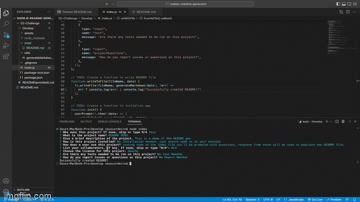

  # README Generator  

  ## Description:
  This project will create a high quality README for you.

  ## Table of Contents:
  - [Installation](#installation)
  - [Usage](#usage)
  - [License](#license)
  - [Contributions](#contributions)
  - [Test](#test)
  - [Reporting](#reporting)

 ## Installation
  No installation needed just download the files and assure you have node installed on your machine.

 ## Usage 
  When the files are in place run NodeJs, you will be prompted with some questions once the questions are answered the responses will be used to populate your README.

  

 ## License 
  N/A
  
 
  

 ## Contributions 
  N/A

 ## Test 
  Link to the Repo - https://github.com/Zcordeiro/nodejs-readme-generator

  Link to the Google Drive Video - https://drive.google.com/drive/folders/1y_3I3ytpejhsdAfJzsDGAiwcaT-LEjL7?usp=sharing

 ## Reporting 
  Email zeus.cordeiro@gmail.com
